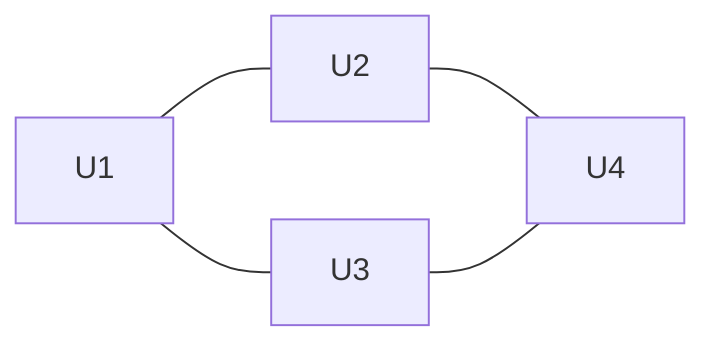
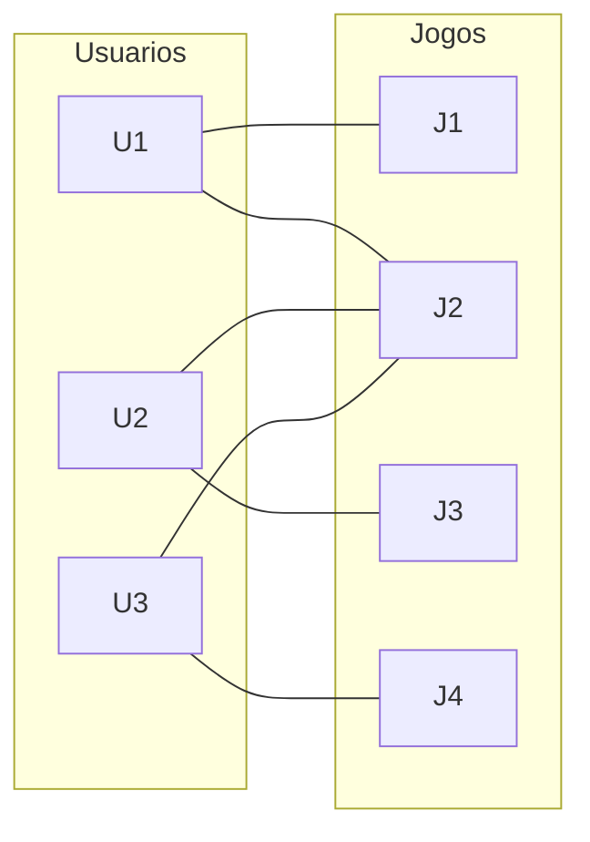

# E1 — Proposta e Definição do Projeto

> **Disciplina:** Teoria dos Grafos
> **Prazo:** 25 de março de 2026
> **Peso:** 10% da nota final

---

## Identificação do Grupo

| Campo                | Preenchimento                  |
| -------------------- | ------------------------------ |
| Nome do projeto      | GameShop                       |
| Integrante 1         | Caio — 38092361                |
| Integrante 2         | Fillipy — 37115928             |
| Integrante 3         | Leonardo — 40731677            |
| Domínio de aplicação | Jogos digitais / redes sociais |

---

## 1. Contexto e Motivação

Plataformas digitais de jogos, como Steam e Xbox Live, possuem milhões de usuários que interagem por meio de amizades e bibliotecas de jogos. 
No entanto, muitos usuários têm dificuldade em descobrir novos jogos relevantes ou encontrar pessoas com interesses semelhantes dentro dessas 
plataformas.
Um problema específico observado é a baixa eficiência em recomendações simples baseadas apenas em popularidade ou categorias genéricas, sem 
considerar relações sociais diretas, como amigos ou usuários com gostos semelhantes.
Neste contexto, este projeto propõe modelar uma rede de usuários e jogos utilizando grafos, com foco na geração de recomendações baseadas em 
conexões reais entre usuários (amigos em comum) e jogos compartilhados, permitindo explorar relações indiretas para melhorar a experiência do 
usuário.

---

## 2. Objetivo Geral

Desenvolver um modelo baseado em grafos capaz de representar usuários, jogos e suas relações, permitindo gerar recomendações de amizades e 
jogos com base na estrutura da rede.

---

## 3. Objetivos Específicos

* Implementar cálculo de similaridade entre usuários com base em jogos em comum
* Gerar lista ordenada de sugestões de amizade utilizando número de amigos em comum
* Implementar recomendação de jogos baseada nos jogos dos amigos
* Aplicar busca em largura (BFS) para identificar conexões indiretas entre usuários
* Exibir recomendações com base em critérios definidos como quantidade de conexões

---

## 4. Público-Alvo / Caso de Uso Principal

O sistema é voltado para usuários de plataformas digitais de jogos que desejam descobrir novos jogos e expandir sua rede de contatos.
Um cenário de uso seria um jogador que, ao acessar a plataforma, recebe sugestões de novos amigos com base em conexões existentes e 
recomendações de jogos com base nas preferências de outros usuários e de seus próprios amigos.

---

## 5. Justificativa Técnica — Por que Grafos?

A Teoria dos Grafos é adequada para este problema pois permite representar usuários e jogos como vértices e suas relações como arestas.
Neste projeto, serão considerados dois tipos principais de relações:
Grafo de amizades (usuário–usuário), não-dirigido
Grafo bipartido (usuário–jogo), representando interações
A recomendação de amizades será baseada na contagem de vizinhos em comum, que pode ser obtida por meio de busca em largura (BFS) de 
profundidade 2.
A recomendação de jogos será realizada por meio de algoritmos de filtragem colaborativa, considerando padrões de preferência e similaridade 
entre usuários com gostos convergentes, a fim de sugerir títulos com base no comportamento e avaliações de perfis semelhantes.
Dessa forma, o uso de grafos permite explorar conexões indiretas e padrões estruturais da rede para gerar recomendações mais relevantes.

---

## 6. Tipo de Grafo

| Característica   | Escolha             | Justificativa                                |
| ---------------- | ------------------- | -------------------------------------------- |
| Dirigido ou não  | Não-dirigido        | Amizades são mútuas                          |
| Ponderado ou não | Não-ponderado       | Similaridade baseada em contagem de conexões |
| Tipo             | Geral + Bipartido   | Separação entre U–U e U–J                    |
| Representação    | Lista de adjacência | Eficiência em grafos esparsos                |

---

## 7. Diagrama Conceitual

USUÁRIOS (U-U amizade)

INTERAÇÕES (U-J bipartido)

 
**Legenda:**
* Nós U = usuários
* Nós J = jogos
* Aresta U–U = amizade
* Aresta U–J = interação

---

## Checklist de Entrega

Antes de submeter, confirme:

* [x] Texto entre 300 e 600 palavras (seções 1 a 5)
* [x] Todos os campos da tabela de identificação preenchidos
* [x] Tipo de grafo especificado com justificativa
* [x] Diagrama presente e referenciado no texto
* [x] Arquivo nomeado como `E1_NomeGrupo_Grafos.docx` (versão Word) ou PR aberto (versão GitHub)

---

*Teoria dos Grafos — Profa. Dra. Andréa Ono Sakai*
